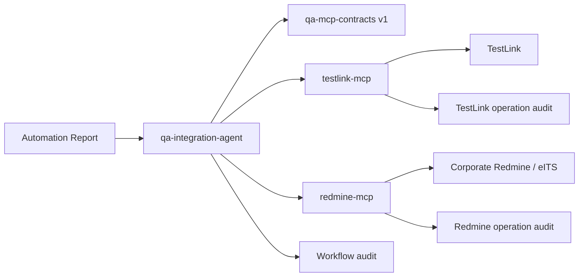

# TestLink Agent 架構

## 目標架構（v2）



| 元件 | 唯一責任 | 可持有的認證 |
|---|---|---|
| `testlink-mcp` | TestLink discovery、精確 target resolution、testcase/execution preview/write、readback verification、operation idempotency | TestLink only |
| `redmine-mcp` | Redmine metadata/template、dedupe、issue/comment preview/write、image upload、operation idempotency | Redmine only |
| `qa-integration-agent` | report parsing、跨系統規劃、persisted preview artifact、compact summary、traceability、workflow audit/resume | 不持有上游 API key |
| `qa-mcp-contracts` | 版本化 schema、canonical payload、digest 與安全驗證 | 無 |

這是「分開 MCP、集中協調」，不是拆成互不相干的兩個 Agent。不同維護團隊可以獨立發版與處理認證；跨系統規則仍由 coordinator 保持一致。舊 `testlink-agent-mcp` 是相容層，僅用於 shadow 與回退，不新增正式整合能力。

## 信任與失敗邊界

- TestLink 與 Redmine 憑證不得交叉放入另一個 MCP，也不得出現在 coordinator tool arguments。
- coordinator 只持有 `QA_TESTLINK_MCP_ENV_FILE`／`QA_REDMINE_MCP_ENV_FILE` 路徑，透過隔離的 stdio child process 呼叫 ownership-specific MCP；child environment 會移除另一系統與 parent 中的 credential variables。
- 三個服務各自 health check、audit 與 release；單一服務故障不得造成另一系統重複寫入。
- coordinator 只交換 contracts 定義的資料，不依賴自然語言 handoff。
- 每筆操作以 `operation_id`、`correlation_id`、payload digest 與 dedupe key 串起三層 audit。
- `corp`／`sandbox` 必須在每個寫入邊界重新驗證，不能只相信呼叫端。

## 相容與演進

- `testlink-mcp` console entrypoint 指向純 TestLink v2 adapter。
- `redmine-mcp` 是獨立 Redmine/eITS adapter。
- `qa-integration-agent-mcp` 是跨系統唯一推薦入口。
- `testlink-agent-mcp` 與舊 CLI 保留一個主要版本作為相容／rollback 路徑。
- contracts 以 major version 演進；v1 欄位語意凍結，破壞性變更建立 v2 而非靜默修改。
- Artifact execute/resume 使用新增工具名稱；既有 v1 execute/resume 留在 `legacy`/`all` toolset，避免以 token 優化為由破壞已發布契約。

`testlink-agent` 提供 `testlink-mcp` server，讓 agent 能安全操作 TestLink，並受控地整合公司 Redmine/eITS 流程。

本專案是 QA 整合層。它不取代 TestLink，也不建立第二套正式 Redmine 流程。

## 系統角色

```text
Automation Report
        |
        v
testlink-agent / testlink-mcp
        |
        +--> TestLink
        |
        +--> Corporate Redmine / eITS
```

## 資料權責

| 領域 | Source of truth | 說明 |
|---|---|---|
| Test project、test plan、platform、build | TestLink | `testlink-agent` 透過 XML-RPC 讀寫。 |
| Test case 與 execution result | TestLink | Execution notes 可以包含 Redmine 追溯資訊。 |
| Bug、RM#、eITS#、assignment、status、fixed version | Corporate Redmine/eITS | 正式缺陷必須使用公司系統。 |
| Automation report 匯入決策 | `testlink-agent` preview + 使用者確認 | 寫入操作必須 opt-in。 |
| 操作證據 | `local/audit/*.json` | 本機 audit 檔案由 git ignore。 |

## 部署邊界

TestLink 與 Redmine/eITS 必須分開：

- 分開的 service
- 分開的 database
- 分開的 backup 與 restore 流程
- 分開的使用者角色與權限
- 只透過 API 整合

如果之後部署本機 Redmine，必須明確命名並文件化為 sandbox。它不能用於正式 RM#、eITS#、release note 或 PQA import 流程。

選用的 `infra/redmine-sandbox/` compose 設定只供開發使用。它不是 production Redmine recipe，也不能接到正式 TestLink/PQA release-note 流程。

## 環境 Profile

每一次可寫入操作都必須知道目標環境：

```text
TESTLINK_AGENT_PROFILE=corp
REDMINE_ENV=corp
```

或：

```text
TESTLINK_AGENT_PROFILE=sandbox
REDMINE_ENV=sandbox
```

`corp` 代表公司正式 TestLink 與公司 Redmine/eITS 流程。`sandbox` 代表本機或開發專用系統。agent 不可推論 sandbox Redmine 是正式系統。

## 寫入安全模型

所有寫入路徑都遵守這個模型：

```text
parse input
  -> validate schema and target profile
  -> resolve TestLink target
  -> compute dedupe key for Fail/Error results
  -> preview TestLink and Redmine actions
  -> wait for explicit confirmation
  -> write
  -> read back and verify
  -> record audit log
```

Testcase create/update 另有 row policy：預設將邏輯步驟合併成單一 TestLink row；
`single_step=false` 只有在同一份已審閱 preview 明確包含 `allow_multi_row=true`
時才可寫入。寫入後若 TestLink 讀回的 row 數或內容不同，操作必須記為
`verification_failed`，不得宣告成功或自動覆寫。

可寫入命令預設都是 preview。Redmine bug creation 也必須 opt-in。破壞性操作需要額外確認。

## 主要模組

| 模組 | 責任 |
|---|---|
| `testlink_agent_core.cli` | CLI 參數與 command routing。 |
| `testlink_agent_core.commands` | CLI command orchestration。 |
| `testlink_agent_core.mcp_server` | MCP server entrypoint 與 tool exposure。 |
| `testlink_agent_core.client` / `clients` | TestLink XML-RPC 存取。 |
| `testlink_agent_core.redmine` | Redmine API 存取與 issue payload 建構。 |
| `testlink_agent_core.reports` | Automation report parsing。 |
| `testlink_agent_core.policy` | 目標環境、允許欄位、去重與冪等規則。 |
| `testlink_agent_core.audit` | 寫入 audit record 與 retry evidence。 |
| `testlink_agent_core.output` | Console/MCP output 與敏感資訊遮罩。 |

`policy.py` 與 `audit.py` 是目前有效的安全模組。任何新的寫入行為都必須重用它們，不要另外實作一次性的 profile、dedupe、audit 或 retry 邏輯。

## 未來結構

不要只為了美觀移動模組。等 policy 與 audit 行為穩定後，core 可以再拆成：

```text
testlink_agent_core/
  integrations/
    testlink_client.py
    redmine_client.py
  reports/
    parser.py
    schema.py
  policy.py
  audit.py
```

這個 migration 必須保持 CLI 與 MCP 行為不變，並維持離線測試通過。

## 非目標

- 不把正式 Redmine 資料存成 TestLink-only 檔案。
- 不把本機 Redmine 當正式缺陷系統。
- 不自動關閉 Redmine issue。
- 不自動指派 issue 或設定 fixed version，除非 manager-owned environment 明確允許。
- 不在 log 或 MCP response 暴露 API key、devKey、token 或 password。
